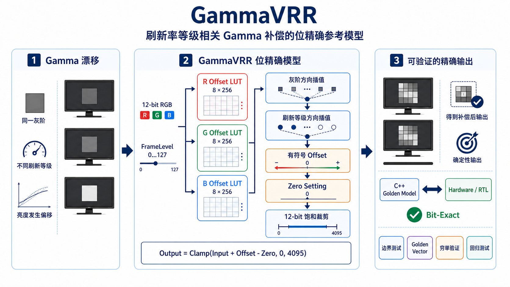

# GammaVRR

**面向刷新率等级相关 Gamma 补偿的位精确 C++ Golden Model。**

[](https://github.com/fei121/Cmodel/actions/workflows/ci.yml)
[](https://en.cppreference.com/w/cpp/20)
[](LICENSE)
[](CHANGELOG.md)

[快速开始](#快速开始) · [算法原理](#工作原理) · [接口集成](#库集成) · [验证体系](#验证体系) · [能力边界](#项目范围与非目标)



## 这个项目是做什么的？

显示器在不同刷新率下，给它同一个灰阶数字，实际显示出来的亮度可能并不完全相同。这种变化会表现为 Gamma 漂移、亮度跳变，甚至出现用户能感知的 VRR 闪烁。

显示芯片通常会为不同的刷新率等级准备多张 Gamma 补偿表。处理一个像素时，芯片根据“当前灰阶”和“当前刷新率等级”查表并插值，再给原始像素加上一个很小的修正值。

GammaVRR 就是这段芯片计算的**软件参考实现**。你可以把它理解成一个“显示芯片的标准答案计算器”：输入一张 12-bit RGB 图像和补偿表，得到芯片理论上应该输出的每个像素值。

例如，某个像素的 R 通道输入值是 `1000`，查表并插值后得到 offset `+6`，模型输出就是 `1006`（最终结果仍会限制在 `0…4095`）。R、G、B 三个通道分别计算。

它本身不会驱动显示器，也不会自动测量面板；它的价值在于让软件、固件、RTL 和芯片结果有一个可以逐像素比较的统一基准。

给定输入图像、三份 `8 × 256` LUT、一个 `FrameLevel` 和 zero setting，模型会产生确定性的预期像素。

硬件图像流水线中有一类问题很容易被低估：即使两个实现使用相同公式，也可能因为中间舍入、有符号运算、端点处理、饱和顺序或缓冲区布局产生不同结果。GammaVRR 将这些细节转化为明确的算法规格、可执行的参考实现和可穷举验证的测试体系。

## 项目亮点

- **位精确整数核心**：正式模型不使用浮点运算。
- **可执行算法规格**：索引、舍入、饱和、旁路和错误行为都有精确定义。
- **小而稳定的接口**：无全局状态，支持重复调用和原地处理。
- **C++ 与 C 集成**：既可使用原生 C++20 接口，也提供稳定的 C 兼容接口。
- **可复现 CLI 流程**：支持处理 P3 和符合标准的 8/16-bit P6 PPM 文件。
- **独立数值验证**：全部 `4096 × 128 × 3 = 1,572,864` 种像素、等级和通道组合都会与独立编写的浮点参考公式比较。
- **跨平台工程**：提供 CMake 构建、安装包，以及 Linux、macOS、Windows CI 配置。
- **数据来源清晰**：示例图像和 LUT 均由本地脚本确定性生成，不依赖来源不明的数据。

## 模型契约

| 属性 | 定义 |
| --- | --- |
| 图像布局 | `R, G, B` 交错排列 |
| 输入与输出 | 无符号 12-bit，范围 `0…4095` |
| LUT 布局 | 三份有符号 `int16` 表，按 level-major 排列 |
| LUT 尺寸 | 每通道 `8` 个刷新率等级锚点 × `256` 个灰阶节点 |
| FrameLevel | 范围 `0…127` 的定点插值坐标 |
| 插值小数位 | 灰阶方向 4-bit，等级方向 4-bit |
| 舍入规则 | 舍入到最近整数，恰好一半时远离零 |
| 饱和规则 | 最终输出裁剪到 `0…4095` |
| 旁路行为 | 输入验证通过后原样复制到输出 |

> [!IMPORTANT]
> `FrameLevel` 是定点插值坐标，不是以 Hz 表示的真实刷新率。如何将物理刷新率映射到 `FrameLevel`，由 LUT 提供方所在的系统决定，不属于本模型的职责。

## 快速开始

### 1. 构建并运行测试

环境要求：CMake 3.20+、Git，以及支持 C++20 的编译器。

```bash
git clone https://github.com/fei121/Cmodel.git
cd Cmodel

cmake -S . -B build -DCMAKE_BUILD_TYPE=Release
cmake --build build --parallel
ctest --test-dir build --output-on-failure
```

启用 CLI 和测试时，CMake 会拉取固定版本的 [CLI11](https://github.com/CLIUtils/CLI11) 和 [Catch2](https://github.com/catchorg/Catch2)。

### 2. 生成版权清晰的示例数据

生成器仅使用 Python 标准库：

```bash
python3 examples/generate_example.py example-data
```

它会生成一张 12-bit RGB 渐变图，以及内容不同的 R/G/B 合成 offset LUT。

### 3. 运行模型

```bash
./build/gammavrr \
  --input example-data/input.ppm \
  --output example-data/output.ppm \
  --lut-r example-data/lut_r.txt \
  --lut-g example-data/lut_g.txt \
  --lut-b example-data/lut_b.txt \
  --frame-level 73 \
  --output-format p6
```

查看完整命令帮助和版本：

```bash
./build/gammavrr --help
./build/gammavrr --version
```

使用 Visual Studio 等多配置生成器时，可执行文件可能位于 `build/Release/`。

## 工作原理

模型将每个 12-bit 像素和传入的 `FrameLevel` 拆分为索引与 4-bit 插值系数：

```text
12-bit 像素
├── 高 8 位 ──> 灰阶节点 0…255
└── 低 4 位 ──> 灰阶插值系数

FrameLevel
├── 高位 ─────> LUT 等级 0…7
└── 低 4 位 ──> 等级插值系数
```

对于每个 R/G/B 子像素，模型依次执行：

```text
1. 在等级 N 内，对相邻两个灰阶节点的 offset 进行插值
2. 在等级 N + 1 内，对相邻两个灰阶节点的 offset 进行插值
3. 根据 FrameLevel，在上述两个中间结果之间再次插值
4. 减去 zero_setting
5. 将有符号 offset 加到输入像素
6. 将结果饱和到 0…4095
```

简化表达为：

```text
output = clamp(input + level_interp(gray_interp(LUT)) - zero_setting, 0, 4095)
```

每一级插值结束后都会立即舍入。将两级插值合并成一个表达式可能产生不同结果，因此不符合本模型规格。完整定义见 [算法规格文档](docs/algorithm.md)。

## 库集成

### C++20 接口

```cpp
#include <gammavrr/model.hpp>

gammavrr::Lut lut = load_your_lut();
gammavrr::Model model(
    {.enabled = true, .zero_setting = 0},
    std::move(lut));

const auto error = model.process(
    {input_samples, width, height},
    frame_level,
    {output_samples, width, height});

if (error != gammavrr::ProcessError::none) {
    // gammavrr::to_string(error) 可返回错误描述。
}
```

模型会先验证完整输入，再修改输出缓冲区。输入和输出可以引用同一块缓冲区。

### C 接口

C 兼容接口定义在 [`include/gammavrr/c_api.h`](include/gammavrr/c_api.h)：

```c
struct gammavrr_params params = {
    .enabled = 1,
    .zero_setting = 0,
    .frame_level = 73,
};

enum gammavrr_status status = gammavrr_process(
    input, input_count,
    output, output_count,
    width, height,
    lut_r, lut_g, lut_b,
    &params);
```

每个 LUT 指针必须提供按 level-major 排列的 `8 × 256` 个有符号数值。图像缓冲区包含 `width × height × 3` 个交错排列的样本。

### 安装并通过 CMake 使用

```bash
cmake --install build --prefix /your/install/prefix
```

在外部项目中：

```cmake
find_package(GammaVRR 1 CONFIG REQUIRED)
target_link_libraries(your_target PRIVATE GammaVRR::gammavrr)
```

只构建无 CLI、无测试依赖的核心库：

```bash
cmake -S . -B build-core \
  -DGAMMAVRR_BUILD_CLI=OFF \
  -DGAMMAVRR_BUILD_TESTS=OFF
cmake --build build-core --parallel
```

## 验证体系

测试体系围绕数值行为设计，而不是单纯追求形式上的代码覆盖率。

| 验证领域 | 验证依据 |
| --- | --- |
| 插值行为 | 固定两级插值 Golden Vector，以及穷举参考公式对比 |
| 舍入规则 | 正负数恰好一半时的舍入用例 |
| 边界处理 | 灰阶节点、FrameLevel 锚点、端点和上下界饱和 |
| 输入安全 | 尺寸、缓冲区、FrameLevel 和像素范围校验 |
| 可重入性 | 无全局状态下的重复调用和原地处理 |
| 文件格式 | P3 与可移植的大端 8/16-bit P6 往返测试 |
| 接口集成 | C 头文件编译、C 接口测试和安装包消费者测试 |
| 运行时检查 | AddressSanitizer 与 UndefinedBehaviorSanitizer 配置 |

运行 Sanitizer：

```bash
cmake -S . -B build-asan \
  -DCMAKE_BUILD_TYPE=Debug \
  -DGAMMAVRR_ENABLE_SANITIZERS=ON
cmake --build build-asan --parallel
ctest --test-dir build-asan --output-on-failure
```

主要数值回归测试位于 [`tests/model_tests.cpp`](tests/model_tests.cpp)。

## 架构

GammaVRR 将数值模型封装在一个小接口后面，并把文件读写、CLI 和 C ABI 作为外围适配器：

```text
PPM/LUT 文件 ──> IO 适配器 ─┐
                             │
C++ 调用方 ─────────────────┼──> 位精确 Model ──> 输出像素
                             │
C 调用方 ───────> C 适配器 ──┘
```

```text
include/gammavrr/  对外 C++ 与 C 接口
src/               位精确核心与文件适配器
app/               命令行适配器
tests/             参考公式、Golden Vector、IO 和 C 接口测试
docs/              规范性算法与发布文档
examples/          确定性合成数据生成器
```

## 项目范围与非目标

GammaVRR 专注回答一个问题：

> 给定补偿 LUT 和 FrameLevel，数字模型应该产生什么精确的 12-bit RGB 输出？

它有意不负责：

- 测量面板亮度或色彩；
- 生成、拟合或优化补偿 LUT；
- 读取实时刷新率；
- 处理实时视频流；
- 控制显示器、驱动或时序控制器；
- 宣称消除所有原因导致的 VRR flicker。

明确这条边界，可以让项目成为一个可信的 Golden Model，而不是一套不完整的显示校准平台。

## 开源许可

GammaVRR 基于 [MIT License](LICENSE) 发布。
